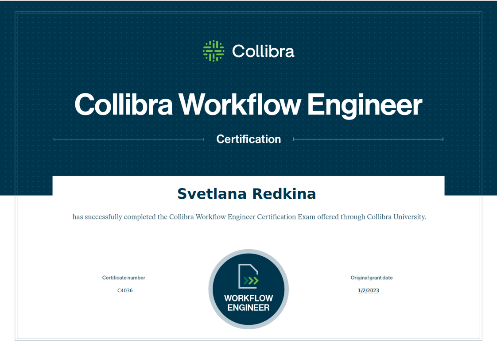

# Collibra-Workflow-Engineer-Certification

 
# Certification Outcomes
- Code and deploy various workflows based on business requirements
- Examine and interpret the console log file to debug workflows and scripts
